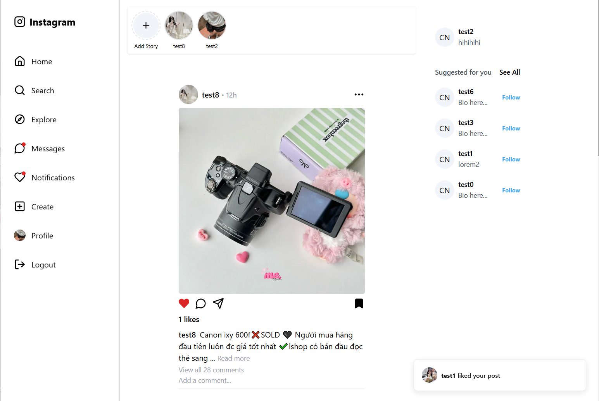
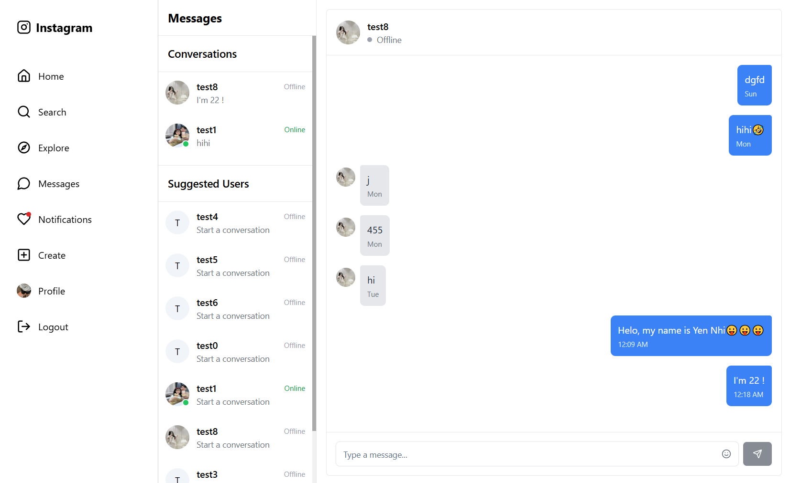

# Social Media App

A fully-featured social media platform with real-time messaging, post sharing, stories, and more.






## 🚀 Technologies Used

### Frontend

- **React 18** - UI library
- **Vite** - Build tool and development server
- **Redux Toolkit** - State management
- **React Router** - Navigation
- **Socket.io Client** - Real-time communication
- **Tailwind CSS** - Styling
- **Radix UI** - Accessible UI components

### Backend

- **Node.js** - Runtime environment
- **Express** - Web framework
- **MongoDB** - Database
- **Mongoose** - MongoDB ODM
- **Socket.io** - Real-time communication
- **JWT** - Authentication (AccessToken and RefreshToken)
- **Bcrypt** - Password hashing
- **Cloudinary** - Image storage
- **Redis** - Caching

## ✨ Features

- User authentication (signup, login, logout)
- Create, read, update, delete posts
- Like and comment on posts
- Real-time messaging
- User profiles
- Stories feature (24-hour temporary content)
- Responsive design for all device sizes

## 📋 Prerequisites

- Node.js (v14 or higher)
- MongoDB (local or Atlas)
- Redis (for caching)
- NPM or Yarn

## 🛠️ Setup and Installation

### Clone the repository

```bash
git clone https://github.com/hoanghoatham03/social-media-app.git
cd social-media-app
```

### Backend Setup

```bash
cd backend
npm install

# Configure environment variables follow .env.example
cp .env.example .env
# Edit .env with your configuration

# Start the server
npm start
```

### Frontend Setup

```bash
cd frontend
npm install

# Configure environment variables follow .env.example
cp .env.example .env
# Edit .env with your configuration

# Start the development server
npm start
```

## 🌐 Environment Variables

### Backend

Create a `.env` file in the backend directory with:

```
PORT=8000
MONGODB_URI=your_mongodb_connection_string
JWT_SECRET=your_jwt_secret
CLOUDINARY_CLOUD_NAME=your_cloudinary_cloud_name
CLOUDINARY_API_KEY=your_cloudinary_api_key
CLOUDINARY_API_SECRET=your_cloudinary_api_secret
REDIS_URI=your_redis_connection_string
```

### Frontend

Create a `.env` file in the frontend directory with:

```
VITE_API_URL=http://localhost:8000/api/v1
VITE_SOCKET_URL=http://localhost:8000
```
